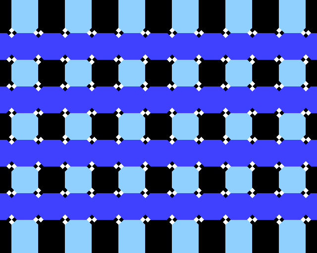
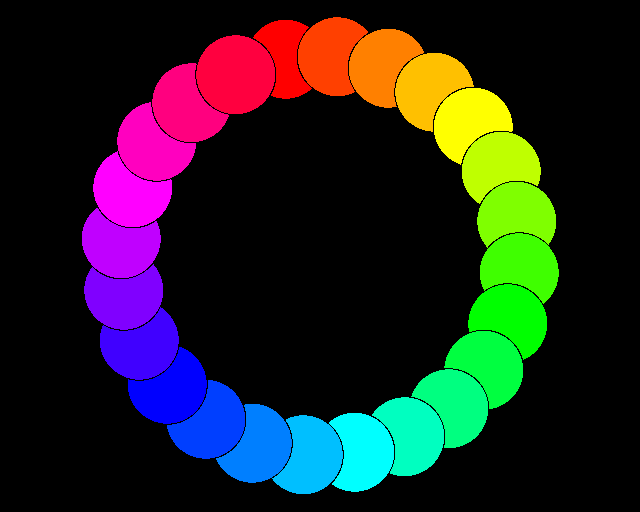
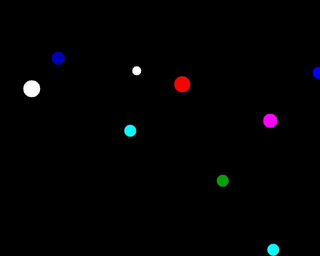

# mini_basic

Python BASIC interpreter: multi-dialect (mini / bbc / mits / commodore / tiny),
REPL/CLI, and file I/O. Regular 1.00 is **text/console only**.

**CLI:** `python -m mini_basic` · `python mini_basic.py` · `mb.py`  
(After a pip install: `mini-basic` / `minibasic`.)

Version: `mini_basic/version.py` (pre-release `1.0.0.dev0` until tagged).

**Docs (HTML):** open [`index.html`](index.html) at the clone root (pages are under [`docs/site/`](docs/site/index.html)) — [install](docs/site/install.html) · [public tree](docs/site/tree.html) · [language](docs/site/LANGUAGE_FEATURES_1.00.html)

**Install the interpreter from GitHub:**

```bash
python -m pip install "mini-basic[repl] @ git+https://github.com/pyTony/mini_basic.git"
mini-basic --version
```

This `main` branch is the lean release tree: the interpreter package,
`basics/` (small standalone programs), `showcase/` (the demo reel below),
and this handbook. The full development tree — `examples/`, `test/`,
`tools/`, `scripts/`, `documentation/`, and the complete per-PR changelog —
lives on the [`dev`](https://github.com/pyTony/mini_basic/tree/dev) branch:

```bash
git clone -b dev https://github.com/pyTony/mini_basic.git   # full dev tree
git clone https://github.com/pyTony/mini_basic.git          # release tree (this branch)
```

| On GitHub | What |
|-----------|------|
| [basics/](https://github.com/pyTony/mini_basic/tree/main/basics) | Small standalone `.bas` files |
| [showcase/](https://github.com/pyTony/mini_basic/tree/main/showcase) | The 8-program demo reel (see below) |
| [docs/](https://github.com/pyTony/mini_basic/tree/main/docs) | Language / release notes |
| [dev branch](https://github.com/pyTony/mini_basic/tree/dev) | Full dev tree: examples/, test/, tools/, scripts/, documentation/ |

Upstream (not this repo): [garyexplains/BASIC-M6502-CPORT](https://github.com/garyexplains/BASIC-M6502-CPORT) · [rtrussell/BBCSDL examples](https://github.com/rtrussell/BBCSDL/tree/master/examples)

## Quick start

```bash
python -m mini_basic basics/MB_COLOR.BAS
python -m mini_basic --dialect mits basics/ELIZA.BAS
python -m mini_basic --dialect bbc basics/BETH.BAS
python -m mini_basic --pygame --dialect bbc basics/mand_mode9_and.bas
python -m mini_basic --pygame --dialect bbc basics/jclock.bas
python -m mini_basic
```

```python
from mini_basic import BASICInterpreter, main
from mini_basic.config import InterpreterConfig

interp = BASICInterpreter(InterpreterConfig(dialect='bbc', display='none'))
```

## Showcase

Eight confirmed-working programs picked to span graphics, fractals,
performance and language features. They live under `showcase/` right here
on `main` and run via `showcase/demo_reel.py`:

```bash
python showcase/demo_reel.py          # run the whole reel
python showcase/demo_reel.py --list   # just print what's in it
```

| | | |
|---|---|---|
|  **disco** — colour lightshow, grid redraw + palette cycling |  **illusion** — cafe-wall optical illusion: a dead-straight grid *looks* bent, purely from alternating corner wedges at each intersection |  **wheel** — spinning colour ring; `CASE`/`WHEN` dispatch, `CIRCLE` discs, `*REFRESH` |
|  **fern** — Barnsley fern fractal via chained `DRAW`/affine steps | **Mandel_ANSI** — Mandelbrot set in ANSI colour, console only, renders in well under a second (the interpreter's perf highlight) |  **bounce** — nested structs `Pos{x,y}`, whole-struct array copy, `+=` on struct members |
| **hanoi** — Towers of Hanoi, solved and animated recursively (interactive: enter a disc count, press SPACE) |  **soccerball** — spinning 3D ball via per-frame matrix rotation | |

`examples/` on the [`dev`](https://github.com/pyTony/mini_basic/tree/dev)
branch has ~30 more confirmed-working programs beyond this reel; see
`examples/README.txt` there for the full tree.

## Dialects (short)

| Dialect | Notes |
|---------|--------|
| `mini` | Default; case-sensitive identifiers; keywords in any case (`for i = 1 to 3` works) |
| `bbc` | BBC-style; case-sensitive identifiers; keywords uppercase only |
| `mits` / `commodore` / `tiny` | Classic-style case-folding |

Product conventions that trip people up:

- Use **`MOD`** for modulo (bare `%` is integer-suffix / binary-literal syntax).
- **`SIN` / `COS` / `TAN` use radians** unless you apply `DEG`/`RAD` helpers.
- Missing `IF … THEN <line>` targets **abort RUN** after printing an IF error.

## Layout

| Path | Purpose |
|------|---------|
| `mini_basic/` | Package: runtime facade, mixins, display, REPL helpers |
| `mini_basic/runtime_parts/` | Mixin modules (core, program, expr, defs, execution, io, graphics, dialect) |
| `mini_basic/type_system.py` | `VarKind`, `BasicRuntimeError`, frames / dataclasses |
| `basics/` | Small standalone BASIC programs |
| `showcase/` | 8-program demo reel + `demo_reel.py` launcher |
| `docs/site/` | Browsable HTML handbook |

The full dev tree (`examples/`, `test/`, `tools/`, `scripts/`,
`documentation/`) lives on the [`dev`](https://github.com/pyTony/mini_basic/tree/dev) branch.

## Tests and development

Tests, dev tooling, and the git workflow docs live on the
[`dev`](https://github.com/pyTony/mini_basic/tree/dev) branch — `test/`,
`pytest.ini`, `GIT_QUICKSTART.md`, `DEVELOPMENT_GIT_USAGE.md`. Check that
branch out to run the test suite:

```bash
git clone -b dev https://github.com/pyTony/mini_basic.git
cd mini_basic
python -m pytest -q -m "phase1 and not slow" --timeout=45
```

LLM / contributor notes: [`docs/LLM.md`](docs/LLM.md).

## Import map

```python
from mini_basic import BASICInterpreter, main
from mini_basic.config import InterpreterConfig, DEFAULT_CONFIG
from mini_basic.format import UsingFormatter
from mini_basic.expr import CompiledExpr, patterns
```

Package-level detail: `mini_basic/README.md`.
