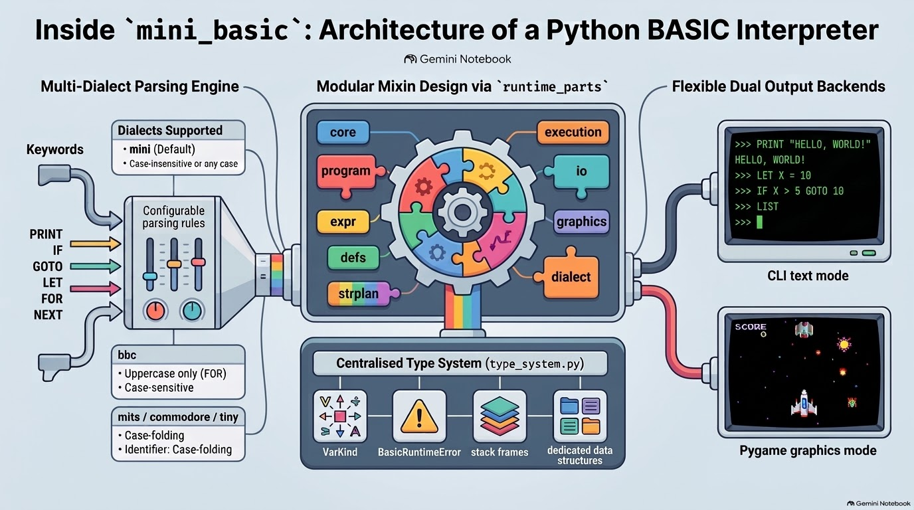

# Notes for people and LLMs

mini_basic is a **multi-dialect BASIC interpreter** (console / text). It is not full BBCSDL, RISC OS, or a packaging toolkit.

## Run

```text
python -m mini_basic basics/MB_COLOR.BAS
python -m mini_basic --help
```

Tests and `examples/` live on the
[`dev`](https://github.com/pyTony/mini_basic/tree/dev) branch, not on this
(`main`) release branch:

```text
git clone -b dev https://github.com/pyTony/mini_basic.git
cd mini_basic
python -m pytest -q -m "phase1 and not slow" --timeout=45
```

## Architecture at a glance



*Overview illustration (generated with Gemini Notebook). On the left, `mini` accepts keywords in any case but variable names stay case-sensitive; `mits` / `commodore` / `tiny` fold both. For where each statement is actually handled, see [DISPATCH_MAP.md](DISPATCH_MAP.md).*

## Language (short)

- Dialects: `mini` (default), `bbc`, `mits`, `commodore`, `tiny`.
- Case-on (default mini/bbc): names are case-sensitive. **bbc** keywords are uppercase only; **mini** accepts any keyword case (`for i = 1 to 3` is stored as `FOR i = 1 TO 3`). `CASE OFF` folds keywords.
- Use `MOD` for modulo. Bare `%` is an integer suffix, not modulo.
- `SIN` / `COS` / `TAN` use **radians** (`DEG` / `RAD` helpers exist).
- Regular product is text-only. Graphics (`--pygame`) is an optional extra, not required.

See [LANGUAGE_FEATURES_1.00.md](LANGUAGE_FEATURES_1.00.md) and [RELEASE_1.00.md](RELEASE_1.00.md).
